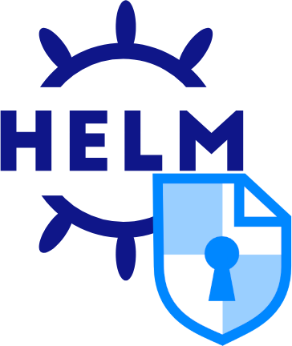

<div align="center">

  
  <h1>CryptPad Helm Chart</h1>
 
  
<!-- Badges -->
<p>
  <a href="https://github.com/cryptpad/helm/graphs/contributors">
    
  </a>
  <a href="https://github.com/cryptpad/helm/commits/main">
    
  </a>
  <a href="https://github.com/cryptpad/helm/network/members">
    
  </a>
  <a href="https://github.com/cryptpad/cryptpad/helm">
    
  </a>
  <a href="https://github.com/cryptpad/helm/issues/">
    
  </a>
  <a href="https://github.com/cryptpad/helm/blob/master/LICENSE">
    
  </a>
</p>
   
<h4>
    <a href="https://github.com/cryptpad/helm">Documentation</a>
  <span> · </span>
    <a href="https://github.com/cryptpad/helm/issues/">Report Bug</a>
  <span> · </span>
    <a href="https://github.com/cryptpad/helm/issues/">Request Feature</a>
  </h4>
</div>

<br />

<!-- Table of Contents -->
# :notebook_with_decorative_cover: Table of Contents

- [:notebook\_with\_decorative\_cover: Table of Contents](#notebook_with_decorative_cover-table-of-contents)
  - [:star2: About the Project](#star2-about-the-project)
  - [:toolbox: Getting Started](#toolbox-getting-started)
    - [:bangbang: Prerequisites](#bangbang-prerequisites)
    - [:books: Documentation](#books-documentation)
    - [:fast\_forward: TL;DR;](#fast\_forward-tldr)
    - [:test\_tube: Running Tests](#test_tube-running-tests)
  - [:wave: Contributing](#wave-contributing)
  - [:warning: License](#warning-license)

<!-- About the Project -->
## :star2: About the Project

This is the [CryptPad](https://cryptpad.org) [Helm Chart](https://helm.sh/) for easy deployment on Kubernetes. 

<!-- Getting Started -->
## :toolbox: Getting Started

<!-- Prerequisites -->
### :bangbang: Prerequisites

This project requires [Kubernetes 1.23+](https://kubernetes.io/) and [Helm](https://helm.sh/docs/intro/install/) installed on your system

### :books: Documentation

* Check documentation on [README.md](charts/cryptpad/README.md) on charts/cryptpad.

### :fast_forward: TL;DR;

Install the Helm Chart using:

```bash
helm repo add cryptpad-github https://cryptpad.github.io/helm
helm install cryptpad cryptpad-github/cryptpad 
```

<!-- Running Tests -->
### :test_tube: Running Tests

To run tests, run the following command

```bash
  for FILE in charts/*; do
     helm unittest $FILE
  done
```

<!-- Contributing -->
## :wave: Contributing

<a href="https://github.com/cryptpad/helm/graphs/contributors">
  
</a>


Contributions are always welcome!

See `CONTRIBUTING.md` for ways to get started.

<!-- License -->
## :warning: License


This software is and will always be available under the GNU Affero General Public License as
published by the Free Software Foundation, either version 3 of the License, or (at your option)
any later version.
